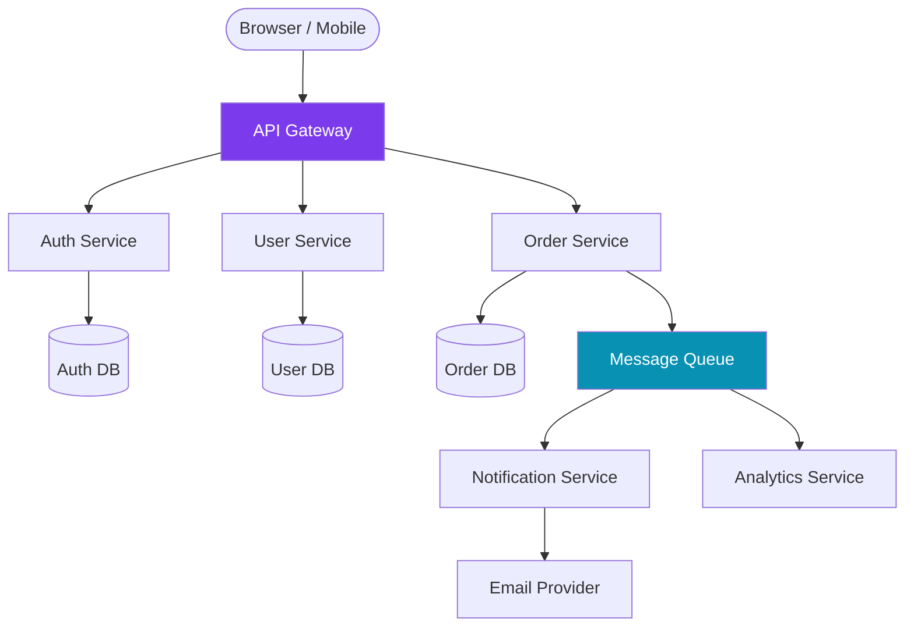
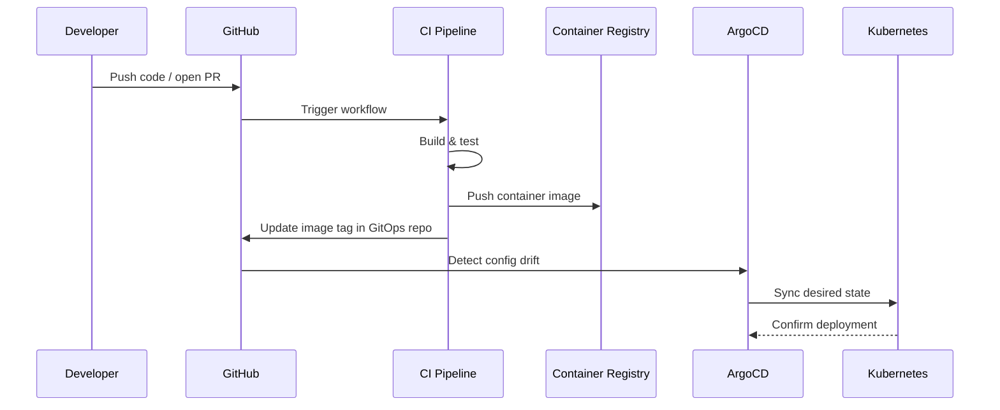
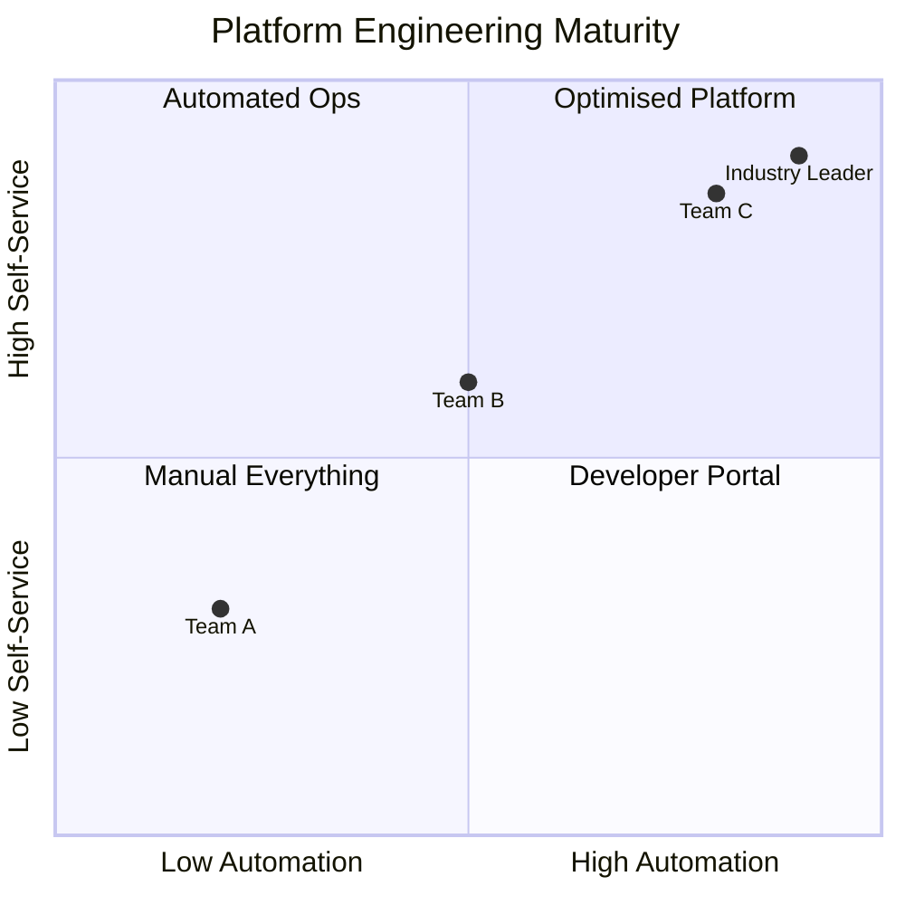

Good documentationlives close to the code. Mermaid diagrams let you define architecture visuals using plain text that you can commit alongside your code and render in any markdown-capable environment.

## Why Mermaid?

Unlike static images, Mermaid diagrams are:
- **Version-controlled** — you can diff and review changes to diagrams
- **Portable** — renders in GitHub, GitLab, Notion, and now this blog
- **Maintainable** — update text, not pixels

## A Simple Microservices Architecture

Here's a typical event-driven microservices architecture:



## Deployment Pipeline

Here's how a GitOps deployment pipeline works:



## Platform Engineering Maturity

A quadrant view of platform engineering maturity:



## Getting Started

To add Mermaid to your own 11ty site, include the Mermaid CDN script and a small initialisation snippet that detects ` ``` `mermaid code blocks and renders them client-side:

```js
import mermaid from 'https://cdn.jsdelivr.net/npm/mermaid@11/dist/mermaid.esm.min.mjs';
mermaid.initialize({ startOnLoad: false, theme: 'default' });

document.addEventListener('DOMContentLoaded', async () => {
  const blocks = document.querySelectorAll('pre code.language-mermaid');
  for (const block of blocks) {
    const pre = block.parentElement;
    const source = block.textContent;
    const container = document.createElement('div');
    container.className = 'mermaid';
    container.textContent = source;
    pre.replaceWith(container);
  }
  await mermaid.run();
});
```

That's all it takes. Diagrams as code, shipped with your content.
